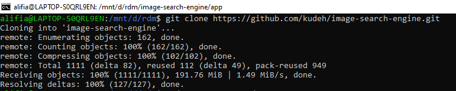
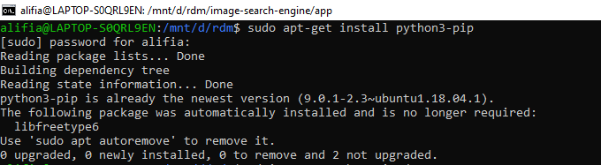
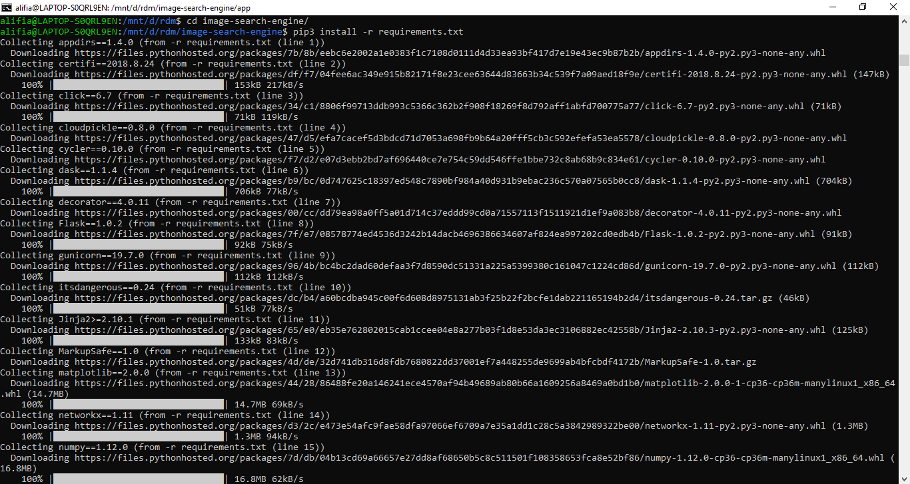
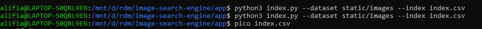
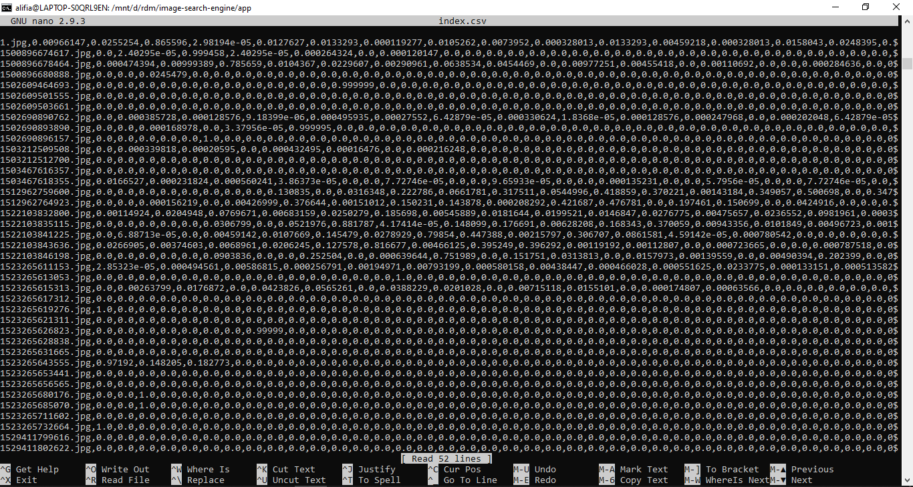
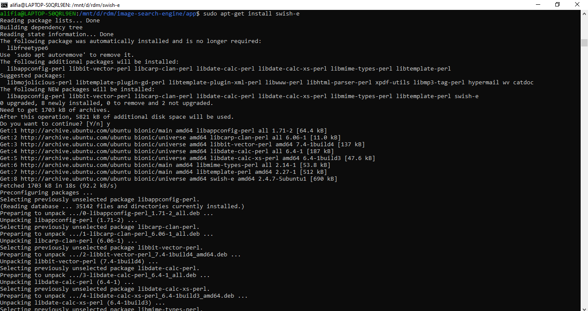
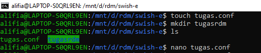
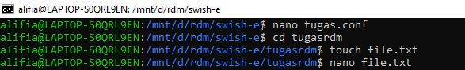
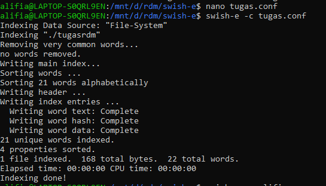
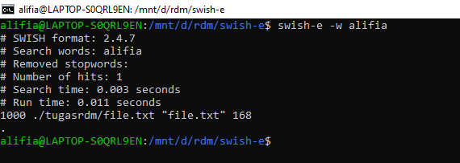

# RDM-Indexing
### -> image-search-engine (Image Indexing)
   1. Clone terlebih dahulu. Syntax : 
      `git clone https://github.com/kudeh/image-search-engine.git`
      
   2. Lakukan Update. Syntax : 
      `sudo apt-get update`
   3. Lakukan Upgrade. Syntax : 
      `sudo apt-get upgrade`
   4. `sudo apt-get install python3-pip`
      
   5. Mulai tahapan untuk menjalankan program. Syntax :
      `cd image-search-engine/` lalu `pip3 install -r requirements.txt` untuk menginstall modul Python
      
      `cd app` selanjutnya jalankan program dengan syntax : `python3 index.py --dataset static/images --index index.csv`
      
   7. cek hasil dengan menggunakan syntax `pico index.csv`
      
   8. Buka ./static/images untuk mengubah image anda
   
### -> Swish-e (Text Indexing)
   1. Install Swish-e. Syntax :
      `sudo apt-get install swish-e`
      
   2. Modifikasi data dengan beberapa sintax, seperti yang terdapat pada screenshot
      - Masukkan syntax `IndexDir ./tugasrdm` dalam tugas.conf                                               
      
      - Masukkan isi dalam file.txt seperti beberapa kata                                                                 
      
   3. untuk menjalankan program text indexing, gunakan syntax : `swish-e -c tugas.conf`
      
   4. untuk menjalankan program dengan mencari salah satu kata, gunakan syntax : `swish-e -w (kata yang diinginkan)`
      

## Sumber
   1. Image-Indexing: https://github.com/kudeh/image-search-engine.
   2. Text-Indexing: Swish-e (Package on Ubuntu).
